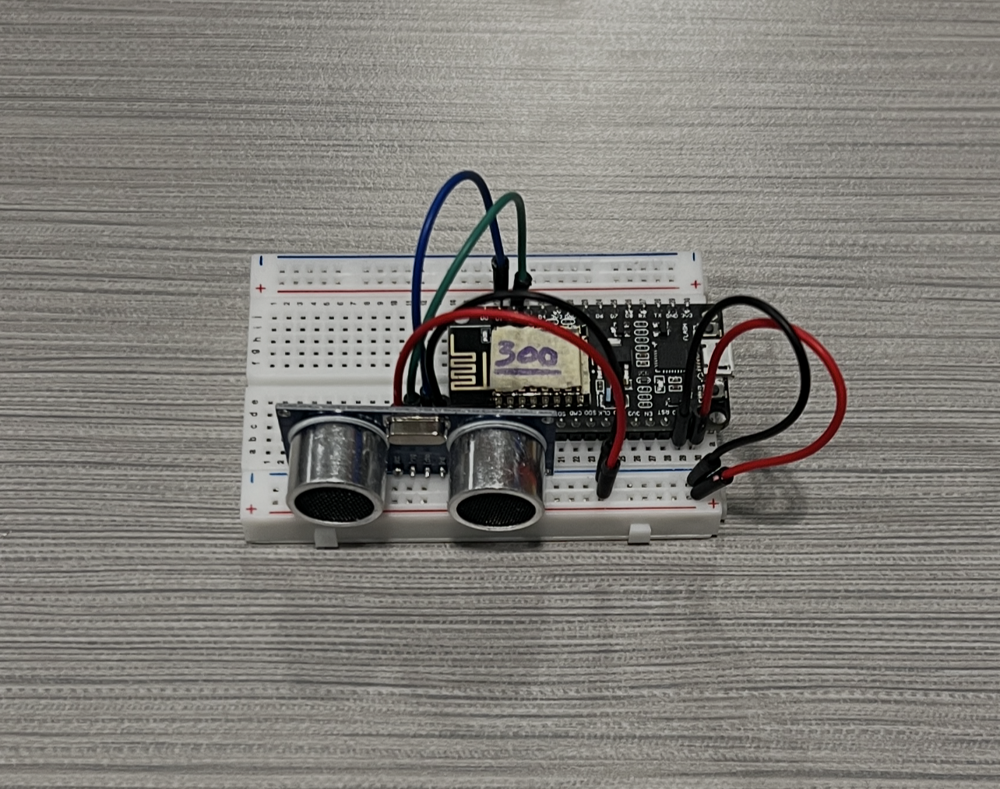
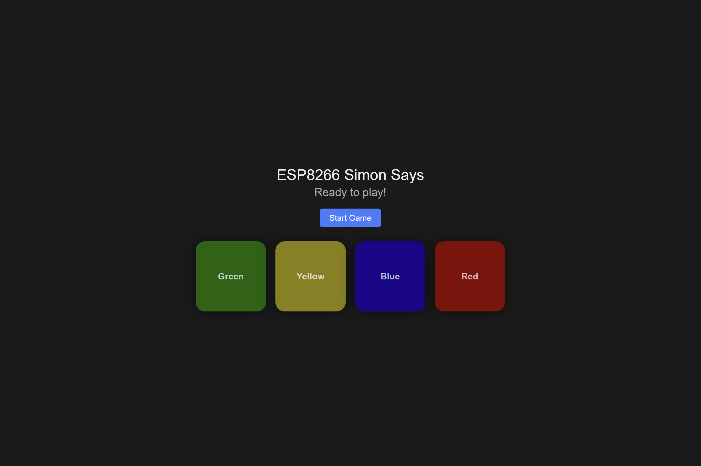

# boxBots2025: ESP8266 Simon Says

A physical, room-scale version of "Simon Says" (Simon/Genius style memory game).
Several standalone stations ("boxes"), each with an ESP8266 and a distance
sensor, are spread out around a room. A Flask server plays back a sequence by
lighting up stations in a web UI, and the player has to physically run to each
station and trigger it (wave a hand in front of it) in the same order. Each
round the sequence gets one step longer.

| Station hardware | Web UI |
|---|---|
|  |  |

## How it works

1. **Stations**: Each station is an ESP8266 (NodeMCU) running an HC-SR04
   ultrasonic distance sensor. When something passes within range
   (5cm to 1.5m), the board POSTs a "trigger" to the server.
2. **Server** (`app.py` + `game.py`): A Flask + Flask-SocketIO app that:
   - Auto-discovers stations on the local network via UDP multicast (no
     hardcoded IPs needed; stations find the server, not the other way
     around).
   - Maps each station's unique chip ID to a color (red/green/yellow/blue).
   - Runs the game state machine: show sequence, wait for player turn,
     check input, advance level or game over.
   - Pushes real-time updates to the browser over WebSockets.
3. **Web UI** (`templates/index.html`, `static/style.css`): Shows one
   colored square per connected station, flashes them in sequence, and
   displays game status (level, whose turn, game over reason).
4. **Gamepad** (`gamepad/`, optional): A wearable/handheld unit with an
   MPU6050 accelerometer (shake to trigger) and an Arduino-driven LCD that
   displays the current color/instruction, connected to the ESP over serial.

## Project layout

| Path | Purpose |
|---|---|
| `app.py` | Flask server: routes, SocketIO events, UDP discovery broadcast |
| `game.py` | Game state machine (sequence generation, timing, win/lose logic) |
| `templates/index.html` | Web UI shown to spectators/host |
| `static/style.css` | Styling for the status squares |
| `esp8266/client.ino` | Firmware for a station: HC-SR04 polling + HTTP POST to server |
| `gamepad/gamepad.ino` | Firmware for the wearable gamepad: accelerometer trigger + SocketIO listener |
| `gamepad/arduino.ino` | Companion Arduino sketch driving the gamepad's LCD over serial |

## Running the server

Requires Python 3 with Flask and Flask-SocketIO installed:

```bash
pip install flask flask-socketio
python app.py
```

The server listens on `0.0.0.0:5000` and broadcasts a UDP discovery packet
every 5 seconds on `224.1.1.1:5007` so stations on the same network can find
it automatically. Open `http://<server-ip>:5000` in a browser to see the game
board.

## Setting up stations

1. Flash `esp8266/client.ino` onto each ESP8266, updating the `ssid` /
   `password` constants for your Wi-Fi network.
2. Wire an HC-SR04 with `TRIG` on D2 (GPIO4) and `ECHO` on D1 (GPIO5).
3. Power it on: the onboard LED fast-flashes while connecting to Wi-Fi,
   slow-blinks while searching for the server, and stays solid once
   connected.
4. Add the board's chip ID (printed to Serial on boot, or logged by the
   server the first time it connects) to `BOARD_COLOR_MAP` in `app.py` so it
   gets assigned a color and shows up in the UI. Unknown chip IDs are
   ignored.

## Playing

Once at least one station is connected, the "Start Game" button on the web
UI becomes enabled. Clicking it shows level 1 (one flash), then waits for the
player to trigger the matching station. Each successful level adds one more
station to the sequence; a wrong station or a 10-second timeout ends the
game.